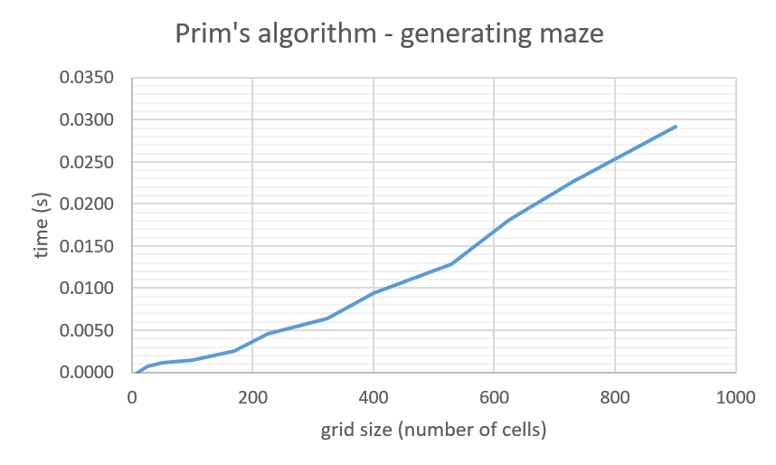
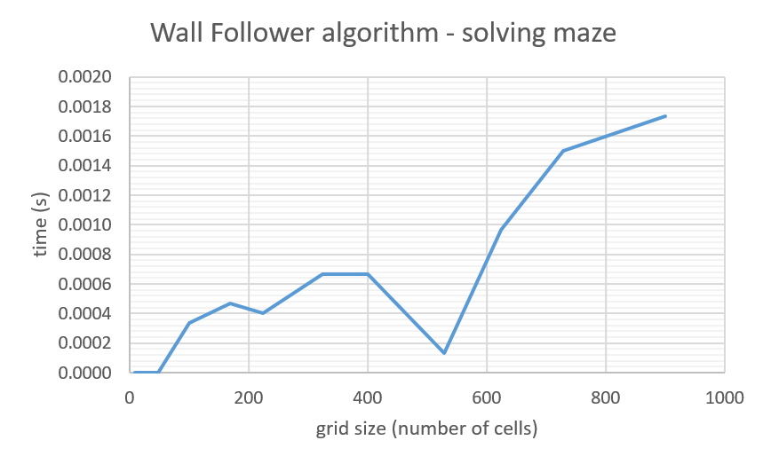

# Implementation

## Structure

Code is divided into files: ```index.py```, ```tremaux.py```, ```wall_follower.py```, ```generate.py```, ```visualize.py```. <br/>
<br/>


1. **index** <br/>
Uses PyGame menu library to display the menu for the user. It asks for inputs: width and height of the maze, and selection of the algorithm to solve the maze: Tremaux or Wall Follower. Wdith and height must be integers in range 3-30. Using the input data, it calls either class ```Tremaux()``` from ```tremaux.py``` file or class ```WallFollower()``` from ```wall_follower.py``` file and passes the width and height arguments. <br/> 

<p align="center">
<br/> 
</p>

2. **tremaux** <br/>
Class ```Tremaux()``` finds the solution path for the maze generated by ```Generate()``` class using Tremaux algorithm. It checks walkable cells (marked ```0```) one by one. First tries to go right, if not possible - go straight, and if not possible - go left. Program starts with the entrance to the maze as a current cell. With every visit, +1 is added to the current cell of the path. If it's a dead end, it goes back following the path it came from and it marks the cells with ```x``` as incorrect path until it finds the first possible intersection with unvisited cells. The recursion stops when exit is found. Solution path is marked with integers starting from 1 (0 - unvisited cell, ie. not solution path). 

3. **wall_follower** <br/>
Class ```WallFollower()``` finds the solution path for the maze generated by ```Generate()``` class using Wall Follower algorithm. It checks walkable cells (marked ```0```) following the route of the left-hand size. The program starts with the maze entrance marked as current cell. It is in the first row of the maze and "standing" on such cell in the walkable direction we face south, hence the left wall is to the east.
    - facing SOUTH, left wall is to the EAST  
    - facing EAST, left wall is to the NORTH
    - facing NORTH, left wall is to the WEST
    - facing WEST, left wall is to the SOUTH <br/>

    The algorithm first checks if there is a wall to the left of the current cell. If not, the solution path goes one step (cell) to its left. Else, the program checks if there is wall in front of the current cell. If there's no wall, one step forward is taken. If there is a wall, the program checks if there is a wall to the right. If there is no wall, one step to the right is taken. By such recursion, the exit is eventually found. However, It is not the shortest solution path, Since it always follows the left wall, it means that the path takes all the (unnecessary) turns - that is shortened when using Tremaux algorithm. 

4. **generate** <br/>
Class ```Generate()``` randomly generates a grid of the maze using randomized Prim's algorithm. Dimensions (width and height) are specified by user input. Coordinates for the current cell are chosen randomly: the starting cell cannot be on the boarder so x is chosen from the range (1, width-1) and y from the range (1, height-1). This point is where generating starts. The current cell is marked as a walkable path (marked ```.```) and walls are drawn around it (marked ```#```). From the existing walls, one is chosen randomly and it becomes a new current cell. It is marked as a path and walls are drawn around it (only empty cells become walls, existing paths are never changes into walls and always remain walkable). Current cell is chosen again and again, and the maze is created by such recusion. Remaining, empty (unvisited, marked ```x``` cells become walls, and function ```self.entrance_exit()``` randomly chooses ```self.entrance``` and ```self.exit``` - points where solution path of the maze should start and finish (entrance is always in the first row and exit in the last row).

5. **visualize** <br/>
Class ```Visualize()``` is called by either ```Tremaux()``` or ```WallFollower()``` when exit of the maze is found. It uses PyGame library to visualize the maze's grid and solution path in the PyGame window. Function ```.draw_grid()``` draws an empty grid of the generated maze: walls are white and walkable paths are black. Function ```.draw_tremaux()``` draws the solution path generated by ```Tremaux()``` class and function ```.draw_wall_follower()``` draws the solution path generated by ```WallFollower()``` class. Solution path is drawn in red. 

<br/>

## Performance





