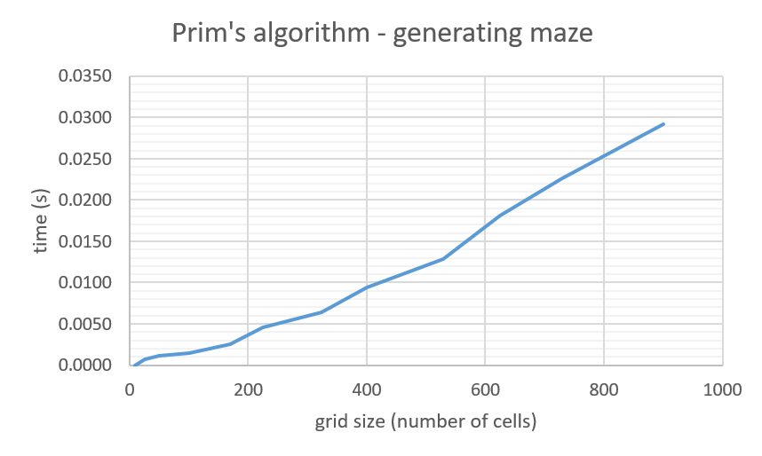

# Testing
There are two separate testing files for classes ```GenerateMaze()``` and ```FindSolution()```: tes_generate_maze.py and test_find_solution.py. Program runs tests using ```unittest```. <br/>Functions of the classes are tested using exemplary input. ```.assertEqual()``` and ```.assertNotEqual()``` are used for comparing expected and returned values, and ```.assertTrue()``` and ```.assertFalse()``` for checking the Boolean values. <br/>

<br/>

## Test coverage


<br/>

## Performance testing
*Graphs shown below are also included in the implementation document.* <br/>


<br/>

<p align="center">
<br/> 
<br/> 
<br/> 
</p>

<br/>
