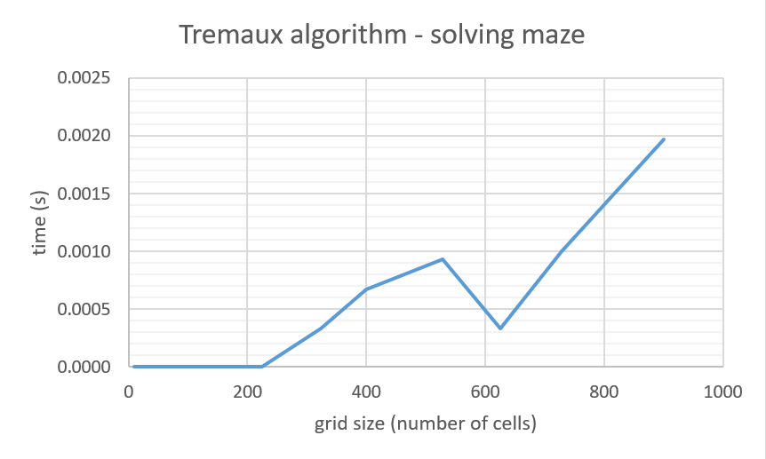

# Testing

<br/>

## General

There are three test files: 
- ```test_tremaux.py``` with ```TestTremaux()``` class for testing ```Tremaux()``` class 
- ```test_wall_follower.py``` with ```TestWallFollower()``` class for testing ```WallFollower()``` class 
- ```test_generate.py``` with ```TestGenerate()``` class for testing ```Generate()``` class. <br/>

Program runs tests using ```unittest``` library. Functions of the classes are tested using exemplary input. ```.assertEqual()``` and ```.assertNotEqual()``` are used for comparing expected and returned values, and ```.assertTrue()``` and ```.assertFalse()``` for checking the Boolean values. <br/>

<br/>

## Input

Maze dimensions: width and height (integer values between 3 and 30). <br/>
For each testing class, a random exemplary maze is used. Such maze is written in the function ```.setUp()``` in required by each class formats, and used througout the whole test class. 

<br/>

## Test coverage


<br/>

## Performance testing
*Graphs shown below are also included in the implementation document.* <br/>

<br/>

Performance of each algorithm has been tested and assesed by measuting the time it takes to return the expected output (ie. generate the grid of the maze or find the solution path). It has been done using ```time``` library. The time was measured by capturing ```start_time = time.time()``` at the beginning of the program performance and ```end_time = time.time()``` when the program stopped: <br/>
- for class ```Generate()```:
  - ```start_time``` in the function ```.__init__()``` before ```self.init_empty_maze()``` was called
  - ```end_time``` in the function ```.entrance_exit()``` after both loops terminated (entrance and exit were created)
- for class ```Tremaux()```:
  - ```start_time``` in the fucntion ```.__init__()``` before ```self.current_cell()``` was called
  - ```end_time``` in the function ```.current_cell()``` if ```exit == True``` before ```Visualize()``` was called
- for class ```WallFollower()```:
  - ```start_time``` in the function ```.__init__()``` before ```self.current_cell()``` was called
  - ```end_time``` in the function ```.current_cell()``` if ```row == len(self.maze)-1 and column == self.exit``` before ```Visualize()``` was called <br/>
<br/>

Total time was calcualted by ```end_time - start_time``` and returned in the floating number format rounded up to 4 decimal places. 

<br/>

<p align="center">
<br/> 
<br/> 
<br/> 
</p>

<br/>

### Collected data and test repetition
<br/>
 
<br/>
I ran Prim's, Tremaux, and Wall Follower algorithms with width and height inputs from the column A, tree times each. I collect times taken for their execution and calculate the average. Grid size and average time are used to create the above graphs: <br/>
- x-axis: grid size (width * height) <br/>
- y-axis: time [s] <br/>

